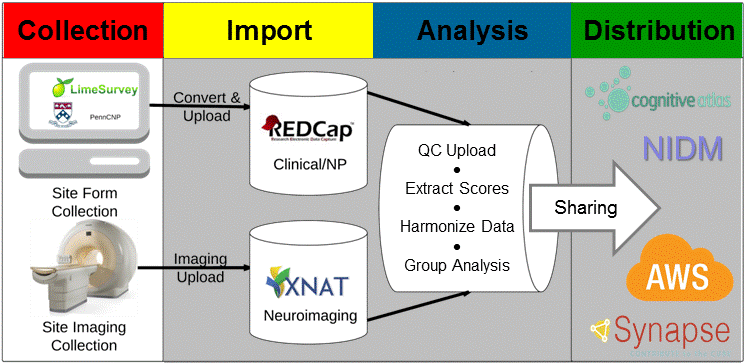

Title: 
Slug: about
Author: Nolan Nichols <http://orcid.org/0000-0003-1099-3328>
Summary: About the SIBIS research group

<h1 align="middle">Scalable Informatics for Biomedical Imaging Studies</h1>

---

Building upon XNAT and REDCap, SIBIS automates electronic data capture, management, harmonization, quality control, analysis, and distribution of data collected by cross-sectional, single site as well as longitudinal, multi-site studies.
All data collected using electronic data capture (e.g. [WebCNP], [LimeSurvey], [Blaise], [ePrime], and REDCap) are merged into a REDCap server hosted at SRI. Data items captured on laptops are automatically extracted, transformed into a compliant format, and loaded into REDCap from a secure and encrypted Subversion version control system. Imaging data is first uploaded from the collection site specific Picture Archiving and Communication Systems (PACS) to a XNAT server hosted at SRI. All data is evaluated with quality control checks that includes automatic test scoring, range validation, and a neuroradiologist report for incidental imaging findings. Issues identified during quality control are reported to the collection site.  Once data passed the initial quality control, the data is processed for further analyses and backed up via Amazon Web Services (AWS). To distribute the processed data, SIBIS the platform has an integrated data release mechanism, which includes compliance with Neuroimaging Data Model (NIDM), enrichment with ontologies such as the Cognitive Atlas, and automatic uploads to data repositories such as Synapse. 

 

#### Publications describing SIBIS: 

* B.N. Nichols and K.M. Pohl: [Neuroinformatics Software Applications Supporting Electronic Data Capture][paper1], Management, and Sharing for the Neuroimaging Community , Neuropsychology Review, Volume 25, Issue 3, pp 356–368

* Torsten Rohlfing, Kevin Cummins, Trevor Henthorn, Weiwei Chu, B Nolan Nichols: [N-CANDA data integration: anatomy of an asynchronous infrastructure for multi-site, multi-instrument longitudinal data capture][paper2], Journal of the American Medical Informatics AssociationVolume 21, Issue 4Pp. 758 - 762.

* K.M. Pohl: [Harmonizing DTI measurements across scanners to examine the development of white matter microstructure in 803 adolescents of the NCANDA study][paper3] NeuroImage, Volume 130, 15 April 2016, Pages 194–213

[WebCNP]: https://webcnp.med.upenn.edu/
[LimeSurvey]: https://www.limesurvey.org
[Blaise]: http://www.blaise.com
[ePrime]: http://www.pstnet.com/eprime.cfm
[paper1]: http://link.springer.com/article/10.1007/s11065-015-9293-x
[paper2]: http://jamia.oxfordjournals.org/content/21/4/758
[paper3]: http://www.sciencedirect.com/science/article/pii/S1053811916000914