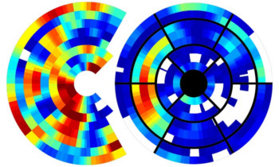

Title:
Slug: cardiac-dyssynchrony
Status: hidden
Summary: Description and Content Cardiac Dyssyncrony
Author:

 

    

<h1 align="middle">Innovative MRI-based Characterization of Cardiac Dyssynchrony</h1>

 

 A significant proportion of patients with heart failure and cardiac dyssynchrony fail to positively respond to cardiac resynchronization therapy, as the current clinical selection criteria are too broad. Our goal is to more accurately characterize the complex shape and motion patterns of cardiac dyssynchrony, through new machine learning technology applied to dynamic cardiovascular magnetic resonance images. We envision that our findings would further improve both our understanding of cardiac dyssynchrony in relation to heart failure and the ability to predict its response to resynchronization therapy, potentially leading to new clinical guidelines and improved clinical outcomes.

 

#### Principal Investigators

 * Leon Axel, New York University
 * Dimitris N. Metaxas, Rutgers University
 * Kilian M. Pohl, SRI International

 

#### Funding

 * [NIH R01HL127661][heart]

 [heart]: https://projectreporter.nih.gov/project_info_description.cfm?aid=9043186&icde=29856855
