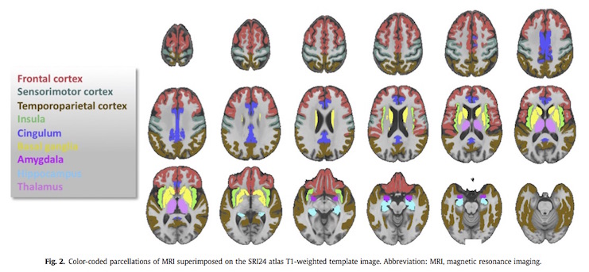

Title:
Slug: hiv-infection
Status: hidden
Summary: Tracking HIV infection
Author:

<h1 align="middle">Tracking HIV Infection and Alcohol abuse CNS Comorbidity with Neuroimaging</h1>

---

The purpose of this project is to elucidate the interaction of HIV infection and alcohol use disorders on central nervous system morbidity and the additional complications of aging arising from extended longevity afforded by advances in anti-HIV pharmacotherapies. The project seeks to establish the pattern of brain pathology with MR imaging and functional measures in an expanded sample of older individuals with HIV infection and the combined morbidity of alcohol abuse; assess longitudinal disease trajectory (progression or effective control) as modulated by alcohol abuse, HCV infection, and ART compliance by testing at 18-month intervals; and establish cross-sectional and longitudinal within-subject relationships among neuroimaging measures, cognitive and motor performance, and clinical status.

 

#### Principal Investigators:

* Adolf Pfefferbaum, SRI International
* Natalie M. Zahr, SRI International

 

#### Collaborators

* Rosemary Fama, SRI International & Stanford University School of Medicine
* Eva Mϋller-Oehring, SRI International & Stanford University School of Medicine
* Edith V. Sullivan, Stanford University School of Medicine

 

#### Funding

 * [NIH AA017347][hiv-infection]

 [hiv-infection]: https://projectreporter.nih.gov/project_info_description.cfm?aid=8901838&icde=29447440
