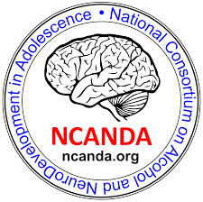

Title: 
Slug: ncanda
Status: hidden
Summary: About the NCANDA Data Analysis Component
Author:

 

    

<h1 align="middle">National Consortium on Alcohol and Neuro-Development in Adolescence</h1>

 

 The purpose of the National Consortium on Alcohol and Neurodevelopment in Adolescence (NCANDA) is to determine the effects of problematic alcohol use on the developing adolescent brain and examine brain characteristics that predict alcohol use disorder. At five sites, the consortium will collect a core battery, including structural and functional brain scans and cognitive testing, and conduct specialty projects on psychological regulation, sleep and alcohol discontinuation. The examination of alcohol consequences will focus on structural and functional maturation of brain areas that actively develop during adolescence, are key to psychological regulation and reward response, and may be vulnerable to toxic alcohol effects.

 

#### Collaborators

 * Sandra Brown and Susan Tapert, UC San Diego.
 * Michael DeBellis, Duke University.
 * Duncan Clark, University of Pittsburg.
 * Bonnie Nagel, Oregon Health and Science University.
 * Ian Colrain and Fiona Baker, SRI International.

 

#### Funding

 * [NIH AA021697 & AA021697-04S1][funding]

 

#### Access NCANDA Data

 To gain access to publicly available data please complete following steps:

 * Create a user name on <a href="https://www.synapse.org">Synapse</a>
 * Fill out the following [form][1] and send it with your synapse user name to <a href="mailto:anoronha@willco.niaaa.nih.gov?subject=Request for Ncanda Data">Antonio Noronha (NIH/NIAAA)</a>
 * NIH will contact applicant about acceptance/rejectance of application.

 Once accepted, the data can be accessed via the <a href="http://dx.doi.org/10.7303/syn3565171">NCANDA Repository at Synapse</a>.

 If you have any questions please contact <a href="mailto:ncanda-support@sri.com?subject=Request for Ncanda Data">ncanda-support@sri.com </a>. 
 

[1]: /images/form/NCANDA-Data-Distribution-Agreement-V1.pdf
[funding]: https://projectreporter.nih.gov/project_info_description.cfm?aid=9069368&icde=31063619&ddparam=&ddvalue=&ddsub=&cr=1&csb=default&cs=ASC