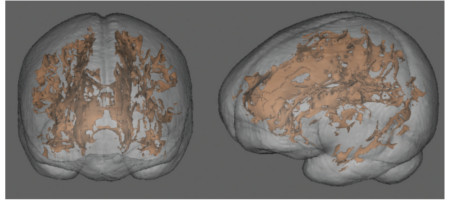

Title:
Slug: cns
Status: hidden
Save_as: pages/projects/cns.html
Summary: Interaction of age and alcoholism
Author:

<h1 align="middle">CNS Deficits: Interaction of Age and Alcoholism</h1>

 

 The marked variability in the location and extent of brain damage among alcoholics, even with similar consumption histories, suggests that factors in addition to excessive alcohol consumption (e.g., dietary deficiency, age at exposure, genetic factors) are determinants in the development of alcoholic brain pathology.  This project aims to study human alcoholics and use a rat model to elucidate factors, in addition to alcohol per se, that contribute to chronic "alcoholic brain damage" and related functional impairment and that could be remedied with therapeutic intervention. The innovative nature of this proposal resides in the goal of reconciling findings in human alcoholism with those of animal models using one of the few approaches available for in vivo ascertainment of alcoholism-induced brain damage – magnetic resonance neuroimaging.

 

#### Principal Investigators

* Adolf Pfefferbaum, SRI International
* Natalie M. Zahr, SRI International

 

#### Collaborators

* Anna Lembke, SRI International
* Michael Ostacher, SRI International
* Edith V. Sullivan, Stanford University School of Medicine

 

#### Funding

 * [NIH AA005965][cns]

[cns]: https://projectreporter.nih.gov/project_info_description.cfm?aid=9042196&icde=29447440
